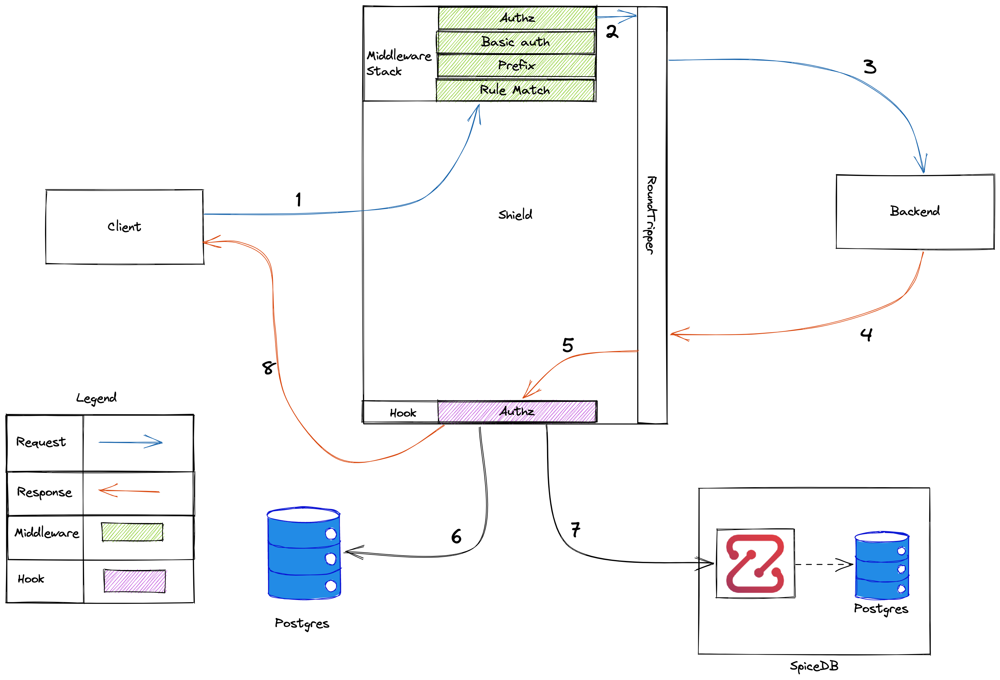

# Introduction

Welcome to the introductory guide to Shield! This guide is the best place to start with Shield. We cover what Shield is, what problems it can solve, how it works, and how you can get started using it. If you are familiar with the basics of Shield, the guides provides a more detailed reference of available features.

## What is Shield?

Shield by ODPF is a role-based cloud-native user management system, identity & access proxy, and authorization server for your applications and API endpoints. It is purely API-driven and provides CLI, HTTP and GRPC APIs and an Admin Portal and for simpler developer experience. Shield is designed to be easy to use Identity and Access Management tool which handles user authentication by providing a Single-Sign-On(SSO) with any provider which adheres to the OIDC Protocol. Shield being an authorization-aware reverse-proxy service, intercepts incoming client requests and evaluate the authorization rules associated with the requested resources. It checks the client's credentials and permissions against the defined access policies before allowing or denying access to the backend services.

## How does shield work?

Here are the steps to work with Shield.

1. Configure policies: This step involes defition of resource types that will exist in the connected backend. User can also configure the roles and permissions that exist.

2. Configure rules: This step involves defining the authorization(via authz middleware) and resource creation(via hook) for each path in the backend.

3. Making Shield proxy request: User can now hit at the shield server followed by the url path.

## Key Features

- **Single-Sign-On(SSO)**: Shield implements the OpenID Connect(OIDC) Protocol that extends the OAuth 2.0 framework to provide authentication and identity information, allowing users to authenticate once and access multiple applications seamlessly. It also enables applications to obtain user identity information for authorization purposes. A Single login and logout for all the underlying application and resources ensure a seamless user experience. 

- **Multiple sources of user identities**: Shield allows seamless integration with any identity provider that supports OIDC, enabling a wide range of options for user authentication. This flexibility empowers organizations to leverage their preferred identity providers, such as Google, Microsoft Azure AD, Github, LinkedIn or others, to authenticate and manage user identities within their organisation's ecosystem.

- **Role-Based-Access-Control(RBAC)**: Shield follows the RBAC model, which means you can assign roles to users, groups, or service accounts. This simplifies access management by providing predefined roles with specific permissions, reducing the need for manual permission assignments.

- **Fine-Grained-Access-Control(FGAC)**: In addition, to RBAC, Shield provides granular control over resource permissions, allowing you to define access at a very detailed level. You can grant or revoke permissions for the project, folder, or individual resources. Using both these Access Control mechanism helps to imporve the security of your organization by reducing the risk of unauthorized access to your resources.   One can use RBAC to assign roles to principals, that give them access to certain applications. For example, you can create a role called "Team Leader" that gives users access to the application.You could then use FGAC to give users specific permissions within those applications. For example, you could give some Team Leader A, the permission to create and edit orders, but not the permission to view customer reports. While another Team Leader B, can have permissions to read them as well.

- **Resource Management**: Shield provides API to create and manage organizations/projects. Admins can create projects and groups within organizations. In addition, group admins can manage groups, add-remove members to the groups, and assign roles to these principals. Using Shield, admins can define policies which bind roles to the underlying resources.

- **Reverse Proxy**: Shield can also restrict access to the proxy api to the users as per attributes and policies.

## Using Shield

You can manage organizations, projects, group, users and resources in any of the following ways:

### Shield Command Line Interface

You can use the Shield command line interface to issue commands and to perform the entire Shield features. Using the command line can be faster and more convenient than using API. For more information on using the Shield CLI, see the CLI Reference page.

### HTTPS API

You can manage relation creation, checking authorization on a resource and much more by using the Shield HTTPS API, which lets you issue HTTPS requests directly to the service. For more information, see the API Reference page.

### Admin Portal

Besides HTTP APIs and CLI tool, Shield provides an provides an out-of-the-box UI for admins to configure SSO for the clients and manage roles, users, groups and organisations in one place.

## Where to go from here

See the [installation](./installation) page to install the Shield CLI. Next, we recommend completing the guides. The tour provides an overview of most of the existing functionality of Shield and takes approximately 30 minutes to complete.

After completing the tour, check out the remainder of the documentation in the reference and concepts sections for your specific areas of interest. We've aimed to provide as much documentation as we can for the various components of Shield to give you a full understanding of Shield's surface area.

Finally, follow the project on [GitHub](https://github.com/odpf/shield), and contact us if you'd like to get involved.
