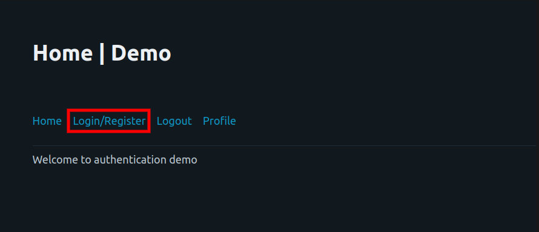
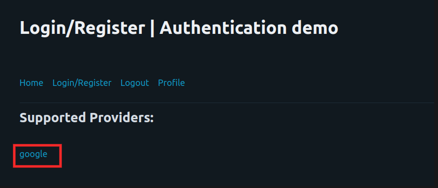

# Authenticating user via the external IDP

## Pre-requisites

- [Set-up an external identity provider for authentication](./setup-idp-oidc.md)
- [Run Migrations and Start the Frontier server](../configurations.md#starting-the-server)

When a user initiates the authentication process, Frontier redirects them to the OIDC authorization endpoint provided by your external IDP (Google in this example).

Upon successful verification, you will receive a [JWT (JSON Web Token)](../concepts/glossary.md#jwt-token) from the IDP. This JWT can be used for subsequent authentication and authorization requests to your application's protected resources.

Let's test how the entire flow for the end user look like using Frontier. Make sure you have the Frontier server up and running by now.

From the current Frontier directory which contains the example application, open the `example/authn` folder and run the `main.go` file.

```bash
$ cd ./example/authn
$ go run main.go
```

1. Open your internet browser and navigate to **http://localhost:8888** for the authentication demo.



2. Select the external identity provider from the list of supported providers.



3. Select an account to login with Google and proceed. If the user fills in valid credentials, the external IDP returns an authorization code to Frontier.

4. Upon receiving these authorization codes from external IDPs (Google here), Frontier issues JSON Web Token that contains claims about the authenticated user. It typically includes information such as the user's unique identifier (sub), email address (email), name (name), profile picture URL (picture), and other user-related information.
   The ID token is digitally signed by the issuer(Frontier), allowing the application to verify its authenticity. <br/><br/>The access token can be used to make authorized API requests to services/application on behalf of the user, if needed. In this example demo, the frontend receives the JWT token from Frontier server and will store it in the client session and pass the session id in cookies.

Upon successful login, this demo app displays the payload of the JSON Web Token generated by Frontier:


Let's break down the parts of this JWT token and see what it reveals about the user's identity to other services:

| **Claim** | **Description** | **Value**                                                                                                                                                                                                                                          |
| --------- | --------------- | -------------------------------------------------------------------------------------------------------------------------------------------------------------------------------------------------------------------------------------------------- |
| **exp**   | Expiration Time | This claim indicates the timestamp when the token will expire.<br/> In this case, the token is set to expire on June 17, 2023, at 16:22:15 UTC.                                                                                                    |
| **iat**   | Issued At       | This claim represents the timestamp when the token was issued. It specifies the exact moment the token was created.<br/> In this case, the token was issued on May 18, 2023, at 16:22:15 UTC.                                                      |
| **iss**   | Issuer          | This claim identifies the issuer of the token. It specifies the URL of the entity that issued the token.<br/>In this case, the token was issued by "http://localhost.frontier".                                                                    |
| **jti**   | JWT ID          | This claim provides a unique identifier for the JWT. It distinguishes the token from other tokens and can be useful for tracking and revoking tokens if necessary.<br/>The JWT ID of this token is "176c9c51-281e-440a-b70a-106efa3c80b2".         |
| **nbf**   | Not Before      | This claim indicates the timestamp before which the token must not be accepted. It ensures that the token is not considered valid until a certain time has passed.<br/> In this case, the token is not valid before May 18, 2023, at 16:22:15 UTC. |
| **org**   | Organization    | This claim indicates the organization to which the user belongs to. Since we haven't yet created an org, this field's value isn't provided in the JWT token                                                                                        |
| **sub**   | Subject         | This claim identifies the subject of the token, which typically refers to the user or entity the token represents (unique user uuid) which in this case "6829c011-4cc4-49d7-8756-14c811558d9c".                                                    |

The profile section verifies that the user is logged in and a user is created in Frontier!!


